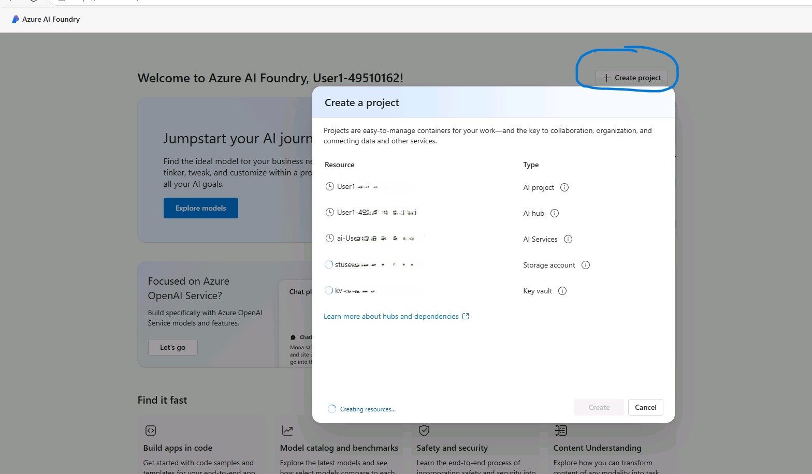
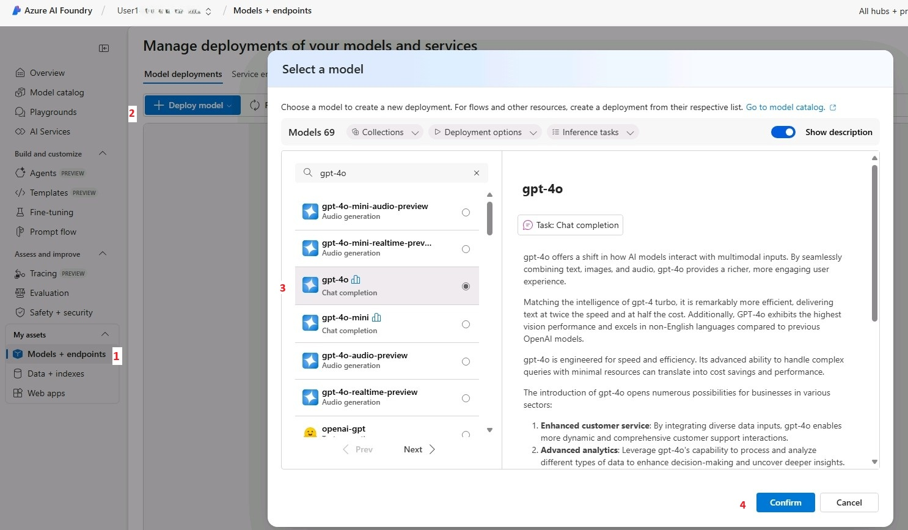
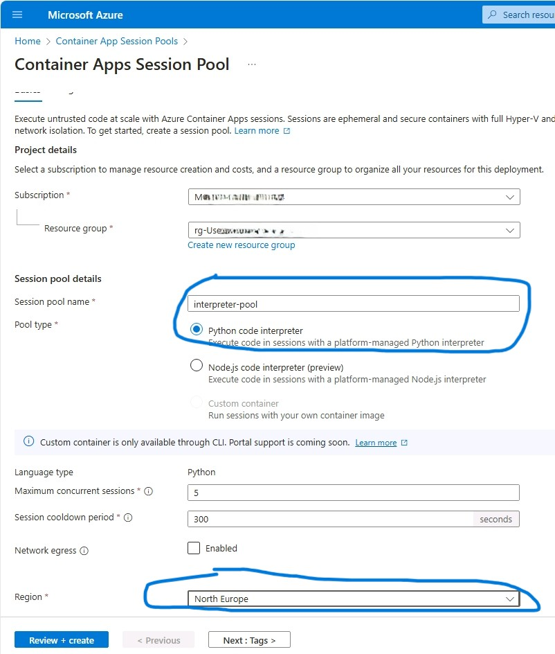
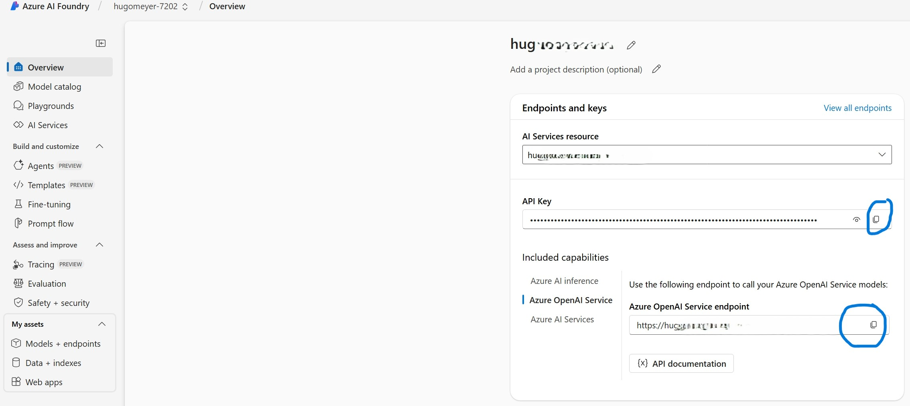

# Multi-Agent Hackathon Guide

## Introduction

Welcome to the MultiagentHackathon workshop! This project is designed to help you learn and practice implementing multi-agent systems using frameworks like AutoGen, Semantic Kernel, and more. The repository contains a series of progressive exercises that will guide you through building increasingly complex agent systems, from simple single-agent interactions to sophisticated multi-agent collaborative scenarios where code is executed in a dynamic Azure Container Apps Pool.

## Setup

### Prerequisites

- Python 3.9+ installed
- An Azure OpenAI API key or OpenAI API key (For production ready deployments, you should refrain from using keys, and switch to managed identities)
- Visual Studio Code

### Infrastructure Setup
#### Infrastructure as Code
You can leverage the Azure Developer CLI, `azd` for short, to deploy the prerequisites to a subscription. It'll create the resources and export some env vars which you can use to run the exercises. To leverage `azd` you need to have it installed and configured. After that, all it takes is a simple `azd up` and the components will be installed.

To install azd you can execute the following command in Powershell.
```Powershell
powershell -ex AllSigned -c "Invoke-RestMethod 'https://aka.ms/install-azd.ps1' | Invoke-Expression"
```

If using Linux, you can run:
```bash
curl -fsSL https://aka.ms/install-azd.sh | bash
```

For a detailed explanation on what it deploys, check out the README.md in the infra directory.

After the components have been deployed, you can navigate to AI Foundry and obtain the Open AI Key and Endpoint. The Open AI endpoint, as well as the Azure Container Apps endpoint will be stored in the azd environment variables. You can leverage those as well. The Open AI Key is not exposed in this manner for security considerations.
#### Azure Portal
1. Navigate to the Azure Portal from the browser of your skillable lab `https://portal.azure.com/#home`
2. Login using the Username and Password available in the Resources tab
3. Open a new tab in your browser and go to `https://ai.azure.com` (you should be logged in already)
4. Create a new project, it should setup for you also a hub.

5. Deploy a GPT-4o model. You can follow the numbered steps in the screenshot below:
 
6. Go back to the Azure Portal, and create a Container App Session Pool. The screenshots below can guide you in the process




### Installation

1. Clone the repository:
   ```bash
   git clone https://github.com/Azure-Samples/multi-agent-workshop
   cd multi-agent-workshop
   ```
2. Select open folder in your VS Code and open the `multi-agent-workshop` folder to see the code in your VS Code.
3. (Optional) Open your code in a devcontainer, using the Dev Containers plugin of VS Code and the devcontainer provided in the repo. Once the plugin is installed, if you open the `.devcontainer/devcotainer.json` file, it should ask you to re-open your repo in a devcontainer. 
4. Install depedencies:

    [uv](https://github.com/astral-sh/uv) is a fast Python package installer and runner. If you haven't installed it yet:
    
   ```Powershell
    powershell -ExecutionPolicy ByPass -c "irm https://astral.sh/uv/install.ps1 | iex"
    $env:Path = "C:\Users\Admin\.local\bin;env:Path"
    uv sync
    ```

    OR (without using uv)
    ```bash
        python -m venv .venv
    ```
    ```powershell
        # On Windows
        .venv\Scripts\activate
    ```
    ```bash
        # On macOS/Linux
        source venv/bin/activate
    ```
    
    ```powershell
      curl https://bootstrap.pypa.io/get-pip.py -o get-pip.py
      python get-pip.py
      pip --version
    ```

    ```bash
        pip install -r requirements.txt
    ```

5. Set up environment variables:
   - Create a `.env` file in your `exercises` directory.
   - Add your API keys and endpoints (you could get this from the Azure Portal, make sure to have the values between quotes):
     ```
     AZURE_OPENAI_URL=your_azure_endpoint
     AZURE_OPENAI_API_KEY=your_azure_api_key
     ACA_POOL_MANAGEMENT_ENDPOINT=you_ACA_pool_endpoint
     ```
   - The following screenshots show you how to get your credentials:
   
   

## Repository Structure

- `src/`: Contains working examples of each exercise. We recommend you to not copy-paste solutions, but only look at this folder when you are stuck with an exercise and need some inspiration.
- `exercises/`: Contains exercise templates for you to complete

## Getting Started

Start with the first exercise and progress through them sequentially. Each exercise builds upon concepts introduced in the previous ones. Click Next when you are ready to continue.

===

## Exercise 0: Call a model

### Objective
Learn how to call your LLM model without using agents.

### Instructions
Refer to `exercises/00_call_models.py` for a complete example.

```Powershell
 uv run .\exercises\00_call_models.py
```

OR (if you are not using uv)

```Powershell
python .\exercises/00_call_models.py
```

This is a very simple script that only calls the LLM deployed. It should serve as the starting point of the next exercises and should validate the connection to your LLM. If the code runs properly, you should see in the terminal a joke created by the model.

===

## Exercise 1: Single Agent

### Objective
Learn how to create and interact with a single AI agent.

### Instructions
Refer to `exercises/01_single_agent.py` for a complete example.

This is the foundation of agent-based systems. Understand how a basic agent system works before proceeding to more complex multi-agent scenarios.

===

## Exercise 2: Two Agents

### Objective
Implement a conversation between two agents (Chandler and Joey) who exchange jokes.

### Instructions
1. Open `exercises/02_two_agents.py`
2. Complete the TODOs in the file:
   - Create a `ChatCompletionClient` using the provided `llm_config`
   - Create two `AssistantAgent` instances with appropriate system messages:
     - Chandler should tell short story jokes related to friends
     - Joey should respond to jokes with another joke
     - Both should be able to end the conversation after 2 jokes by saying 'FINISH'
   - Create a termination condition using `TextMentionTermination`
   - Create a `RoundRobinGroupChat` team with both agents
   - Run the conversation and print the results
   - Reset the team and run another conversation as a stream
3. Documentation is available here: [Autogen Docs](https://microsoft.github.io/autogen/stable/index.html)

### Expected Outcome
Two agents exchanging jokes in a structured conversation that terminates after a set number of exchanges.

===

## Exercise 3: Two Agents Guessing Game

### Objective
Create a number guessing game where two agents interact: one tries to guess a random number, and the other provides feedback.

### Instructions
1. Open `exercises/03_two_agents_guessing_game.py`
2. Complete the TODOs in the file:
   - Create an OpenAI model client using `ChatCompletionClient.load_component()`
   - Create a guesser agent that tries to guess a number between 1-100
   - Create a player agent that provides feedback on guesses (too high/too low)
   - Set up a termination condition that ends the game when 'FINISH' is mentioned
   - Create a team with the two agents using `RoundRobinGroupChat`
   - Uncomment the code that runs the team chat to test your implementation
3. Documentation is available here: [Autogen Docs](https://microsoft.github.io/autogen/stable/index.html)

### Expected Outcome
A functional guessing game where agents take turns until the correct number is guessed.

===

## Exercise 4: Generate and Run Code in Conversations

### Objective
Build a system with two agents that can write and execute code collaboratively.

### Instructions
1. Open `exercises/04_generate_and_run_code_in_conversations.py`
2. Complete the TODOs:
   - Create a system message for the code writer agent with specific instructions
   - Set up a local command line executor using `LocalCommandLineCodeExecutor`
   - Create a code executor agent that uses this executor
   - Create a code writer agent with the system message defined earlier
   - Implement a termination condition for when "FINISH" is mentioned
   - Create a team with round-robin chat including both agents
3. Documentation is available here: [Autogen Docs](https://microsoft.github.io/autogen/stable/index.html)

### Expected Outcome
A system where one agent proposes Python code to calculate the 14th Fibonacci number, and another agent executes it. It is important to note that in this example, the code_executor_agent executes the code locally, can you think about reasons to avoid this?

===

## Exercise 5: Custom Agents Run Code

### Objective
Implement custom agents with code execution capabilities using the AutoGen Core framework. You can think of this code as an evolved or more production ready version of the previous exercise, where the agents interact for a longer time to solve a more complex problem. You will notice that the Assistant agent keeps track of the history of the conversation and keep working on the problem until the executor is able to provide the expected output.

### Instructions
1. Open `exercises/05_custom_agents_run_code.py`
2. Complete the TODOs:
   - Initialize chat history with a SystemMessage in the Assistant class
   - Implement message handling logic for the Assistant
   - Create a function to extract code blocks from markdown text
   - Implement the message handler for the Executor agent
   - Complete the main function to set up and run the coding agents
   - Call the `coding_agents` function with `asyncio.run()`
3. Documentation is available here: [Autogen Docs](https://microsoft.github.io/autogen/stable/index.html)

### Expected Outcome
A system where an assistant generates code in markdown blocks, and an executor extracts and runs that code. After the code is executed succesfully, you should be able to see the output in the `exercises/generated` folder.

===

## Exercise 6: Human in the Loop

### Objective
Create a human-in-the-loop interaction between an assistant agent and a user proxy agent.

### Instructions
1. Open `exercises/06_human_in_the_loop.py`
2. Complete the TODOs:
   - Create a `ChatCompletionClient` using the provided LLM configuration
   - Initialize an `AssistantAgent` with the created client
   - Initialize a `UserProxyAgent` to get user input from the console
   - Create a termination condition that ends when the user says "APPROVE"
   - Create a `RoundRobinGroupChat` team with the assistant and user proxy agents
   - Run the conversation and stream to the console
3. Documentation is available here: [Autogen Docs](https://microsoft.github.io/autogen/stable/index.html)

### Expected Outcome
An interactive session where a human can converse with an AI assistant until they approve the results.

===

## Exercise 7: Functions Invoked by Agents

### Objective
Implement a function that can be invoked by an agent and configure the agent to use it.

### Instructions
1. Open `exercises/07_functions_invoked_by_agents.py`
2. Complete the TODOs:
   - Implement the calculator function to perform basic arithmetic operations
   - Initialize the `AssistantAgent` with proper configuration:
     - Give it an appropriate name
     - Write a system message instructing it to use the calculator and get_time tool
     - Set up the model client
     - Add the calculator function to the tools list
     - Configure whether the agent should reflect on tool use
   - Process user input and get the assistant's response
3. Documentation is available here: [Autogen Docs](https://microsoft.github.io/autogen/stable/index.html)

### Expected Outcome
An agent that can perform calculations using a custom calculator function when prompted.

===

## Exercise 8: Generate Run Code in Remote Container on ACA

### Objective
Learn how to execute code in a remote Azure Container Apps environment for secure and isolated execution.

### Troubleshooting
This is the first time that you will interact with the ACA Session Pool, thus, you might require to run the following command beforehand:

```Powershell
az login 
## Select your subscription from the list and continue
```
### Instructions
1. Open `exercises/08_generate_run_code_in_remote_container_on_aca_langchain.py`
2. Implement the `RemoteExecutor` class:
   - Initialize parameters for connection to Azure Container Apps
   - Implement the `execute_code_blocks` method to run code in a remote container
3. Complete the `run_remote_coding_agents` function:
   - Load environment variables
   - Set up the agent runtime
   - Initialize the model client and remote executor
   - Register the assistant and executor agents
   - Start the runtime and publish an initial message
4. Documentation is available here: [Autogen Docs](https://microsoft.github.io/autogen/stable/index.html); [LangChain](https://api.python.langchain.com/en/latest/tools/langchain_azure_dynamic_sessions.tools.sessions.SessionsPythonREPLTool.html)

### Expected Outcome
A system that can generate and execute code in a secure, remote container environment.

===

## Exercise 9: Group Chat Coding Problem with Semantic Kernel

### Objective
Set up a group chat between two agents using Semantic Kernel to solve coding problems.

### Instructions
1. Open `exercises/09_group_chat_coding_problem_sk.py`
2. Implement the missing functions:
   - `create_code_agent`: Create an agent specialized in executing Python code
     - Configure the Python code interpreter tool
     - Add the code interpreter plugin to the kernel
     - Create a ChatCompletionAgent with appropriate description
   - `create_chat_agent`: Create a chat agent that interacts with users and coordinates with the code agent
   - Complete the `main` function to:
     - Create the agents
     - Set up an agent group chat
     - Create a chat history with initial system message
     - Add the user question and start the group chat
     - Display messages from each agent
3. Documentation is available here: [Autogen Docs](https://microsoft.github.io/autogen/stable/index.html); [Semantic Kernel](https://learn.microsoft.com/en-us/semantic-kernel/)

### Expected Outcome
A group chat where agents collaborate to solve coding problems, with one agent generating code and another executing it.

===

## Conclusion

Congratulations on completing the MultiagentHackathon exercises! You've learned how to create and manage various types of agent systems, from simple single-agent interactions to complex multi-agent collaborations with code execution capabilities.

### Next Steps

1. Try modifying the agents' system prompts to see how it affects their behavior
2. Experiment with different termination conditions
3. Create your own multi-agent system for a specific use case
4. Explore more advanced features like:
   - Memory and state management
   - Tool use and function calling
   - Integration with external APIs

We welcome your contributions and feedback to improve this hackathon. Please submit issues or pull requests to the repository.

Happy coding!